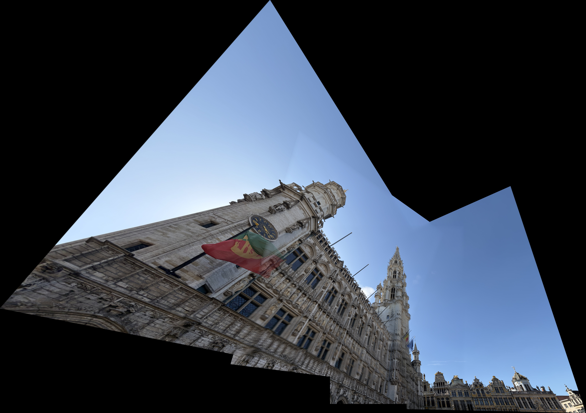
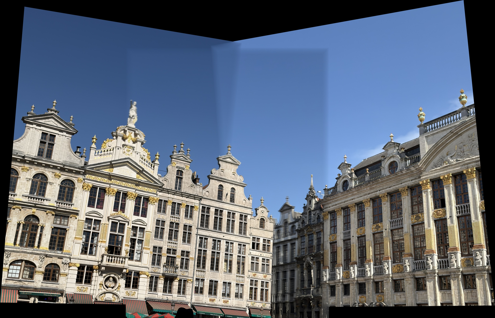
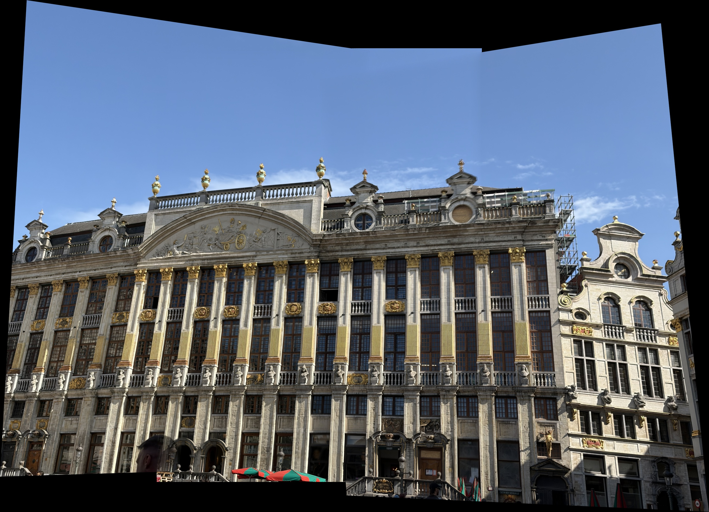

# 🧩 Feature Panorama Stitcher

Automatic panorama image stitching using feature matching and homography estimation.

## 📌 Overview

Feature Panorama Stitcher는 여러 장의 겹치는 이미지를 입력으로 받아 하나의 넓은 panorama image(파노라마 이미지)를 생성하는 프로젝트입니다.

이 프로젝트는 OpenCV의 `Stitcher`와 같은 high-level API를 단순히 사용하지 않고, feature detection, feature matching, RANSAC 기반 homography estimation, perspective warping, feather blending을 직접 조합하여 image stitching을 수행합니다.

## ✨ Main Features

- 여러 장의 overlapping image를 이용한 panorama image 생성
- ORB 또는 SIFT 기반 feature detection 및 descriptor extraction
- BFMatcher를 이용한 feature matching
- RANSAC을 이용한 outlier rejection
- Homography estimation을 이용한 이미지 좌표계 정렬
- Perspective warping을 이용한 이미지 정합
- Feather blending을 이용한 이미지 경계 완화
- Automatic cropping을 이용한 유효 영역 추출
- Matching result와 RANSAC inlier 시각화 저장

## 📁 Project Structure

```text
feature-panorama-stitcher/
├─ data/
│  ├─ building_01/
│  │  ├─ input_01.jpg
│  │  ├─ input_02.jpg
│  │  ├─ input_03.jpg
│  │  └─ input_04.jpg
│  ├─ building_02/
│  │  ├─ input_01.jpg
│  │  ├─ input_02.jpg
│  │  └─ input_03.jpg
│  └─ building_03/
│     ├─ input_01.jpg
│     ├─ input_02.jpg
│     └─ input_03.jpg
├─ results/
│  ├─ building_01/
│  │  ├─ stitched_panorama.jpg
│  │  ├─ stitched_panorama_raw.jpg
│  │  └─ debug/
│  ├─ building_02/
│  │  ├─ stitched_panorama.jpg
│  │  ├─ stitched_panorama_raw.jpg
│  │  └─ debug/
│  └─ building_03/
│     ├─ stitched_panorama.jpg
│     ├─ stitched_panorama_raw.jpg
│     └─ debug/
├─ src/
│  └─ stitcher.py
├─ README.md
├─ requirements.txt
└─ .gitignore
```


## 📦 Requirements

```text
opencv-python
numpy
```

## ⚙️ Installation


```bash
pip install -r requirements.txt
```

## 🚀 Usage

각 이미지 그룹은 서로 다른 건물을 촬영한 데이터이므로, 그룹별로 따로 실행합니다.

### ex) Building 01

```bash
python src/stitcher.py --input data/building_01 --output results/building_01/stitched_panorama.jpg --debug-dir results/building_01/debug
```

## 🛠️ Method

본 프로젝트의 image stitching 과정은 다음과 같습니다.

### 🔍 1. Feature Detection and Description

입력 이미지를 grayscale image로 변환한 뒤, ORB 또는 SIFT를 이용하여 keypoint와 descriptor를 추출합니다.

ORB는 FAST 기반 feature point detector와 BRIEF 기반 binary descriptor를 결합한 방식입니다. 이진 descriptor는 Hamming distance를 이용하여 빠르게 비교할 수 있습니다.

### 🔗 2. Feature Matching

인접한 이미지 쌍 사이에서 descriptor를 비교하여 corresponding points를 찾습니다.

초기 matching result에는 올바른 match뿐만 아니라 잘못 연결된 outlier도 포함될 수 있습니다.

### 🎯 3. RANSAC-based Homography Estimation

잘못된 matching을 제거하기 위해 RANSAC(Random Sample Consensus)을 사용합니다.

RANSAC은 일부 대응점을 무작위로 선택하여 homography를 추정하고, 전체 대응점 중 해당 변환을 잘 따르는 inlier(정상 대응점)를 선택합니다.

이 과정을 통해 이미지 사이의 변환 관계를 나타내는 homography matrix를 계산합니다.

### 🌀 4. Perspective Warping

계산된 homography를 이용하여 각 이미지를 공통 좌표계로 변환합니다.

OpenCV의 `cv.warpPerspective()`를 사용하여 perspective warping을 수행하고, 모든 이미지가 들어갈 수 있는 큰 canvas에 배치합니다.

### 🪶 5. Feather Blending

이미지가 겹치는 영역에서 경계가 딱딱하게 보이지 않도록 feather blending을 적용합니다.

각 이미지의 경계에서는 weight를 작게, 이미지 내부에서는 weight를 크게 설정하여 여러 이미지를 부드럽게 합성합니다.

### ✂️ 6. Automatic Cropping

Warping 이후 생기는 불필요한 black border를 줄이기 위해 실제 이미지가 존재하는 영역을 기준으로 automatic cropping을 수행합니다.

## 🏙️ Dataset

본 프로젝트에서는 서로 다른 건물 3개를 촬영하여 테스트했습니다.

| Dataset | Number of Images | Description             |
|---|---:|-------------------------|
| Building 01 | 4 images | 세로로 긴 건물 외관을 아래 시점에서 촬영 |
| Building 02 | 3 images | 넓은 건물 광장 장면을 좌우 방향으로 촬영 |
| Building 03 | 3 images | 정면 건물 외관을 중심으로 촬영       |

각 이미지 그룹은 서로 다른 장소를 촬영한 것이므로 하나의 panorama로 합치지 않고, 그룹별로 독립적으로 image stitching을 수행했습니다.

## 🖼️ Results

### 🏛️ Building 01 Result



Building 01은 세로로 긴 건물과 하늘 영역이 함께 포함된 이미지 그룹입니다. 이미지 간 feature correspondence를 기반으로 정합되었으며, 큰 perspective change가 포함되어 있어 일부 왜곡과 black border가 발생했습니다.

### 🏛️ Building 02 Result



Building 02는 넓은 건물 외관을 좌우 방향으로 촬영한 이미지 그룹입니다. 전체 건물 구조는 비교적 잘 정합되었지만, 하늘 영역에서는 texture가 부족하여 seam(이음새)이 일부 보입니다.

### 🏛️ Building 03 Result



Building 03은 건물 정면을 중심으로 촬영한 이미지 그룹입니다. 세 이미지 간 overlap이 충분하여 feature matching이 안정적으로 수행되었고, 세 결과 중 가장 자연스러운 panorama image가 생성되었습니다.

## 🧪 Debug Results

프로그램은 각 이미지 쌍에 대해 matching visualization 결과를 저장합니다.

예시 파일은 다음과 같습니다.

```text
results/building_01/debug/
├─ image_02_to_image_01_all_matches.jpg
├─ image_02_to_image_01_ransac_inliers.jpg
├─ image_03_to_image_02_all_matches.jpg
├─ image_03_to_image_02_ransac_inliers.jpg
...
```

- `all_matches.jpg`: ratio test(비율 테스트)를 통과한 전체 feature matching 결과
- `ransac_inliers.jpg`: RANSAC을 통해 선택된 inlier matching(정상 대응점 매칭) 결과

이를 통해 최종 panorama image가 어떤 대응점을 기반으로 만들어졌는지 확인할 수 있습니다.

## ➕ Additional Features

### 1. Feather Blending

단순히 이미지를 덮어쓰는 방식은 overlap region에서 경계가 뚜렷하게 보일 수 있습니다.

이를 줄이기 위해 distance transform을 기반으로 weight map을 만들고, 이미지 내부는 높은 가중치, 경계 부분은 낮은 가중치를 갖도록 하여 feather blending을 적용했습니다.

### 2. Automatic Cropping

Homography warping 이후에는 이미지 외부 영역이 검은색으로 채워질 수 있습니다. 최종 결과를 더 깔끔하게 만들기 위해 실제 이미지가 존재하는 valid region(유효 영역)을 찾아 자동으로 crop했습니다.

### 3. Matching Visualization

각 이미지 쌍에 대해 전체 matching result(매칭 결과)와 RANSAC inlier result(랜색 정상 대응점 결과)를 저장하여, image stitching이 어떤 correspondence를 기반으로 수행되었는지 확인할 수 있도록 했습니다.

## ⚠️ Limitations

현재 구현은 classical computer vision 기반의 feature matching과 planar homography를 사용합니다. 따라서 다음과 같은 경우에는 결과 품질이 떨어질 수 있습니다.

- 이미지 간 overlap이 부족한 경우
- 하늘이나 흰 벽처럼 texture가 부족한 영역이 많은 경우
- 가까운 물체와 먼 물체가 함께 있어 depth variation이 큰 경우
- 사람, 자동차, 깃발처럼 움직이는 object가 포함된 경우
- 촬영 시점 차이가 너무 커서 perspective distortion이 큰 경우
- 이미지 간 exposure 또는 brightness가 크게 다른 경우

실제 결과에서도 일부 black border, seam(이음새), ghosting(겹침 흔적)이 남아 있습니다. 이는 여러 시점에서 촬영된 이미지를 하나의 planar homography로 정렬하는 과정에서 발생할 수 있는 한계입니다.

## ✅ Conclusion

Feature Panorama Stitcher는 feature detection, descriptor matching, RANSAC-based homography estimation, perspective warping, feather blending을 이용하여 여러 장의 이미지를 하나의 panorama image로 자동 정합하는 프로젝트입니다.

세 개의 서로 다른 건물 이미지 그룹에 대해 실험한 결과, 이미지 간 overlap이 충분하고 건물 구조처럼 distinctive feature가 많은 경우 안정적으로 panorama image를 생성할 수 있음을 확인했습니다.